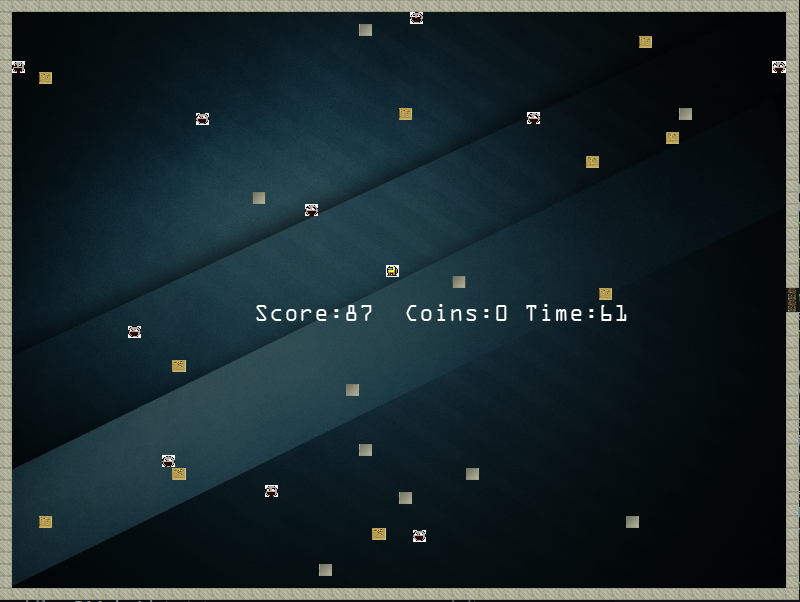

# DUNGEON-MASTER


# SETUP
* Clone the repository
* To install all the dependencies , directly run the make file  and play
```
$ make
$ ./game
```
# RULES

* The player has to stay within the outer four walls which form the boundary of the game .  
* The dungeon consists of ```3``` levels, each harder than the previous one. Higher difficulty is realised by increasing the number of enemies and their speed while reducing the speed of the player at the same time.  
* Your goal is to collect more number of coins and maximise your score as you progress through the levels .  
* You have an option to toggle the lights on and off. The lights are on by default, but if they are off, you will only be able to see walls, enemies and coins in a ```1```-unit radius. However, the score increases at a much faster rate in the dark.
* If you successfully manage to complete all 3 levels, the Amogus will be saved and you will win the game.

# CONTROLS 
**W** - Move up  
**A** - Move left  
**S** - Move down   
**D** - Move right  
**Esc** - Quit  
**SPACE** - Toggle lights on and off  
